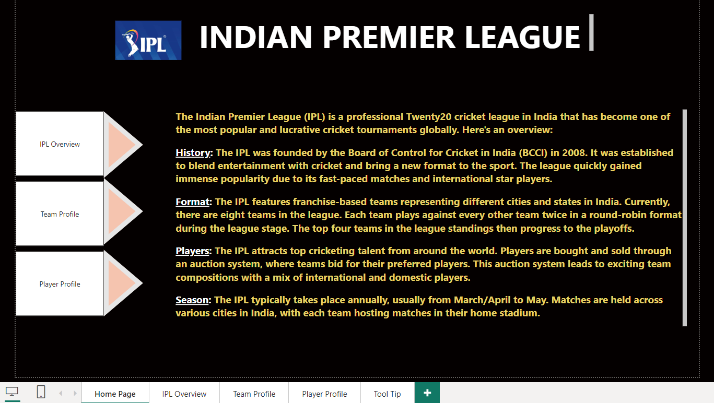
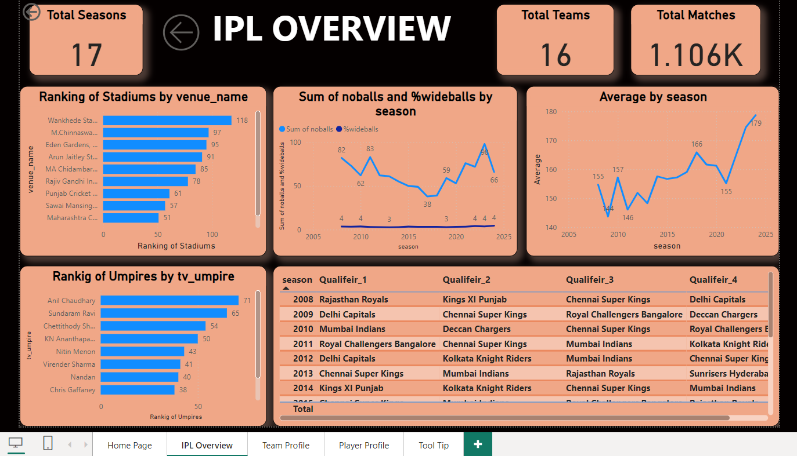
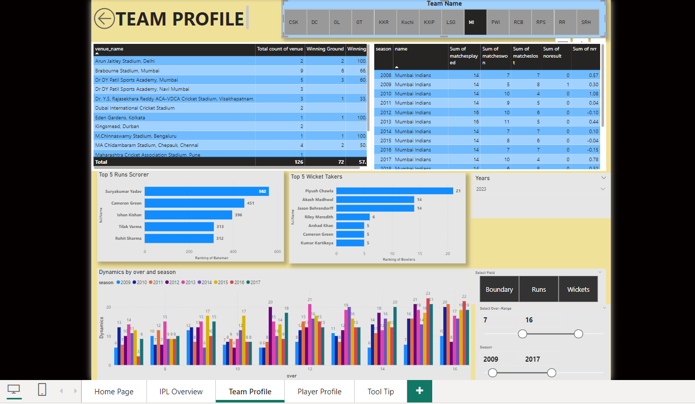
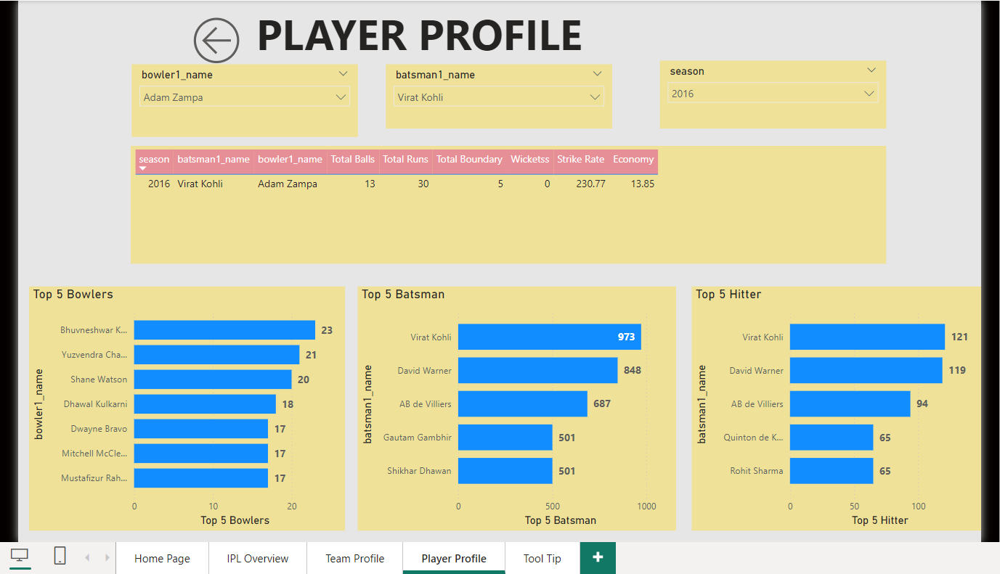

# IPL-Data-Analysis-in-Power-BI

## Overview
This project provides a comprehensive analysis of the Indian Premier League (IPL) using Power BI. This project provides valuable insights into various aspects of the Indian Premier League, allowing users to explore and understand patterns in team performance, player contributions, and match outcomes. By leveraging interactive visualizations and powerful data analytics features, this project enables a deeper comprehension of IPL trends over the seasons.

## Features
- **IPL Introduction**: It provides general details about the IPL including history, format and players.
  
- **IPL Overview**: A high-level summary of the total number of seasons, matches, teams, average runs, and qualifiers per season.
  
- **Team Profile**: Interactive visuals showcasing wins, losses, and key statistics per team across various seasons.
- **Venue Insights**: An analysis of stadium performance metrics, such as win rates at different venues.
  
- **Player Performance**: Detailed player statistics including top run-scorers, leading wicket-takers, top 5 hitters, and face-off between batsman and bowler.
- **Season-wise Analysis**: Year-by-year breakdowns showing trends in the competition, including the highest scores and highest wicket-takers
  
  
## Power BI Features Used
- **Data Import & Transformation**: Imported IPL data from CSV files, and transformed it using Power Query.
- **Relationships**: Created data model relationships between tables such as all_season_summary, all_season_details, all_seasonn_batting_card, all_season_bowling_card, and points_table etc.
- **DAX Measures**: Used DAX (Data Analysis Expressions) to calculate complex metrics like average, ranking of stadiums, randing of umpires, total boundaries, Winning %, and economy etc.
- **Visualizations**: Used various Power BI visualizations like bar charts, line charts, pie charts, and tables to display insights.
- **Filters & Slicers**: Enabled interactive filtering based on teams, players, and seasons.

## Data Sources
The following data sources were used for this analysis:
- **all_season_summary**: It provides comprehensive details about each match like, season, match_id, venu_name,home_team, away_team, home_captain, away_captain, super_over, description, player_of_match etc.
- **all_season_details**: It provides statistics per ball and includes match details like comment_id, match_id, innings_id, short_text, batsman1, batsman2, bowlwer1, bowler2, over, and ball etc
- **all_seasons_batting_card**: Batting statistics like season, venue, fours, sixes, boundaries, batsman name, strikerate etc.
- **all_seasons_bowling_card**: Bowling statistics like, season, team name, overs, maidens, wickets, economy rates, and dots etc.
- **point_table**: Includes match details like season, rank, name, matcheswon, matcheslost, matchpoints, and nrr etc.

## How to Use
1. Clone this repository.
2. Open the Power BI file (`IPL.pbix`) in Power BI Desktop.
3. Explore the various reports and dashboards available within the file. Use slicers and filters for specific insights.

## Requirements
- Power BI Desktop version June 2023 or later.
